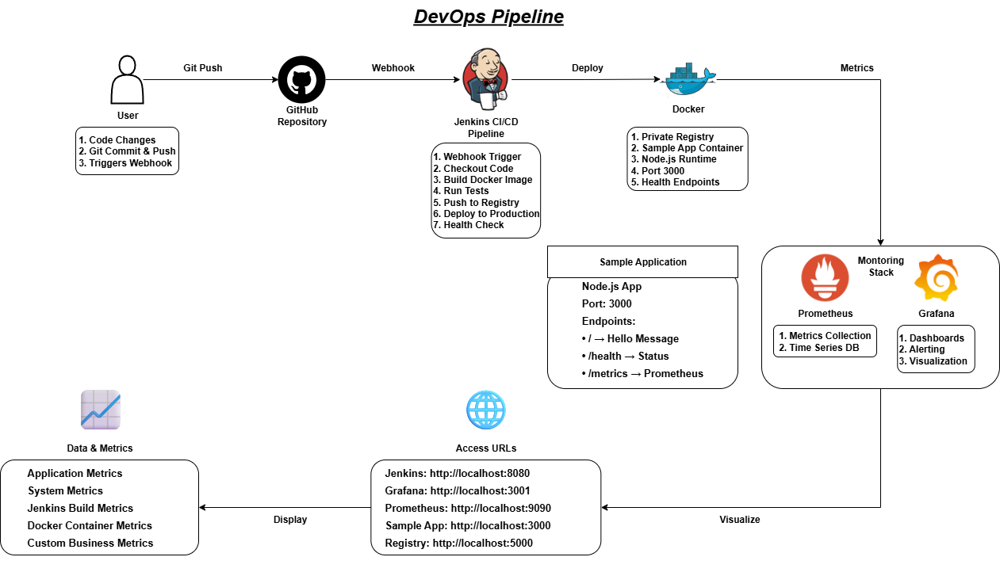

# Complete DevOps Pipeline




A complete CI/CD pipeline using Jenkins, Docker, Prometheus, and Grafana.

## 🚀 Features

- **CI/CD**: Jenkins pipeline for automated builds and deployments
- **Containerization**: Docker with multi-container setup
- **Monitoring**: Prometheus for metrics collection
- **Visualization**: Grafana for dashboards and alerts
- **Registry**: Private Docker registry for images

## 📁 Project Structure

-devops-pipeline/
├── apps/ # Sample applications
│ └── sample-app/ # Node.js sample app
├── jenkins/ # Jenkins configuration
├── monitoring/ # Prometheus + Grafana
├── registry/ # Docker registry
├── scripts/ # Deployment and utility scripts
└── config-templates/ # Configuration templates

## 🛠️ Quick Start

### 1. Start All Services
```bash
# Start Jenkins
cd jenkins && docker-compose up -d

# Start Monitoring
cd monitoring && docker-compose up -d

# Start Sample App
cd apps/sample-app && docker-compose up -d

# Start Registry
cd registry && docker-compose up -d
```

Access Services
Jenkins: http://localhost:8080

Grafana: http://localhost:3001 (admin/admin123)

Prometheus: http://localhost:9090

Sample App: http://localhost:3000

Registry: http://localhost:5000/v2/_catalog

``` Jenkins Setup
Get initial admin password:
docker exec jenkins cat /var/jenkins_home/secrets/initialAdminPassword
```

## 🔧 Configuration 
Copy and update configuration templates from config-templates/ directory.

## 📊 Monitoring
Import dashboards in Grafana


